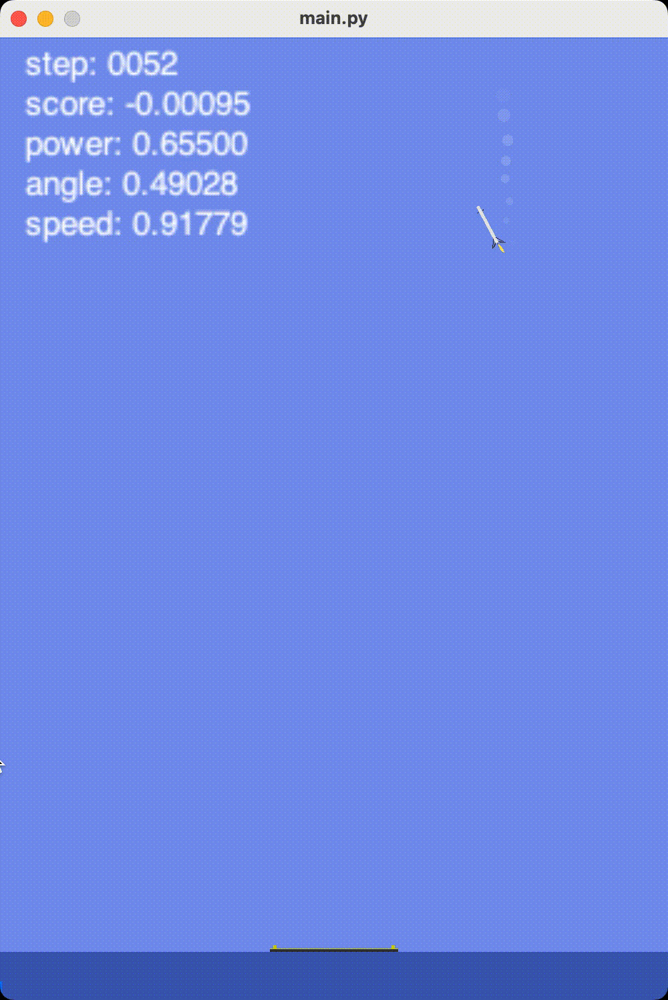

# Rocket landing based on RL PPO implementation
基于PPO强化学习的火箭降落控制

- reinforcement learning PPO
- stable_baselines3


## Preview




## Installation


```bash

# mac
brew install swig

# windows
# download swig: https://sourceforge.net/projects/swig/files/swigwin/
# add environment variable to PATH
# install vs .... 😌

# pythin env
python3.9 -m venv .venv
source ./.venv/bin/activate 

# python requirements
pip install -r requirements.txt

python main.py test

```


## TF logs

```
tensorboard --logdir ./log
```

## stable_baselines3 verbose

### Rollout (回合数据)
- `ep_len_mean`: 平均每个episodes(回合)的长度。当前是479，这通常表明智能体在回合中的表现。
- `ep_rew_mean`: 平均每个回合的奖励，当前是 -3.43。负值通常说明智能体表现尚未达到期望。

关注重点：
- `ep_len_mean` 和 `ep_rew_mean` 是监督模型学习过程表现的重要指标。

### Time (时间数据)
- `fps`: 每秒的帧数，当前是 1223。这个指标反映了算法运行的速度，不需要过分关注。
- `iterations`: 当前训练迭代次数，已到28次，这一般反映训练的进度。
- `time_elapsed`: 已经经过的训练时间，单位是秒，当前375秒。
- `total_timesteps`: 累计的时间步数，当前是 458752，这通常表示训练规模。

### Train (训练数据)
- `approx_kl`: 近似的KL散度，代表新老策略之间的差异，0.009表示较小变化。
- `clip_fraction`: 被裁剪的比率，表明策略更新时有多少采样被裁剪，这里是0.102。
- `clip_range`: 裁剪范围（默认0.2）。
- `entropy_loss`: 熵损失，反映策略的随机性，-3.77表示策略不那么随机。
- `explained_variance`: 解释方差，0.981非常接近1，表明价值函数能够很好地拟合回报。
- `learning_rate`: 学习率，0.0003是默认学习率，影响模型的更新速度。
- `loss`: 总损失，0.009表示模型损失较小。
- `n_updates`: 迭代更新数，当前是270，是重要的训练过程指标。
- `policy_gradient_loss`: 策略梯度损失，-0.00523表示负值，通常是降低总损失。
- `std`: 标准差，这里的0.854须配合其他标准观察。
- `value_loss`: 值函数损失，0.000236表示值函数（返回回报的预计函数）拟合得较好。

关注重点：
- `approx_kl`, `entropy_loss`, `explained_variance`, `value_loss` 是监督策略梯度和价值函数的重要指标。
- `clip_fraction`、`loss`也需要关注，其高或低反映了模型更新过程中的健康程度和训练效果。

### 总结
尤为需要关注的是`ep_rew_mean`、`explained_variance`、`value_loss`等，它们直接表明了智能体的表现和模型的拟合状况。当前这些数据表明模型表现尚可但有提升空间：负现金流（负奖励）和总时间步数共同揭示训练规模和效果，训练时间是否高效优化要结合设备性能。


```bash
#截屏 MP4 to gif 文件
ffmpeg -i ./xx.mp4 -r 10 -pix_fmt rgb24 output.gif
```
